# Explotación y mitigación de Broken Authentication

Algunos sitios web ofrecen un proceso de registro de usuarios que automatiza (o semiautoma) el aprovisionamiento del acceso del sistema a los usuarios. Los requisitos de identidad para el acceso varían de una identificación positiva a ninguna, dependiendo de los requisitos de seguridad del sistema. Muchas aplicaciones públicas automatizan completamente el proceso de registro y aprovisionamiento porque el tamaño de la base de usuarios hace que sea imposible administrar manualmente. Sin embargo, muchas aplicaciones corporativas aprovisionarán a los usuarios manualmente, por lo que este caso de prueba puede no aplicarse.

Esto puede incluir credenciales débiles, almacenamiento inseguro de contraseñas, gestión inadecuada de sesiones y falta de protección contra ataques de fuerza bruta.

**Consecuencias de Autenticación débil:**
- Descubrimiento de credenciales de usuario.
- Ejecución de ataques de suplantación de usuarios.


## Explotación de Broken authentication

El primer paso que hacemos después de levantar el contenedor de docker de la pila LAMP, es crear una base de datos de usuarios, yo en mi caso ya la tengo creada de otra práctica:

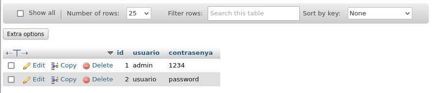

Luego necesitamos **hydra** (en mi caso ya lo tengo instalado, pero en el caso de no tenerlo se instala asi):

``` sudo apt install hydra ```

Ahora nos descargamos un diccionario de contraseñas del siguiente enlace:

[https://weakpass.com/download/90/rockyou.txt.gz](https://weakpass.com/download/90/rockyou.txt.gz)

```
cd /usr/share
wget https://weakpass.com/download/90/rockyou.txt.gz
gunzip rockyou.txt.gz
```
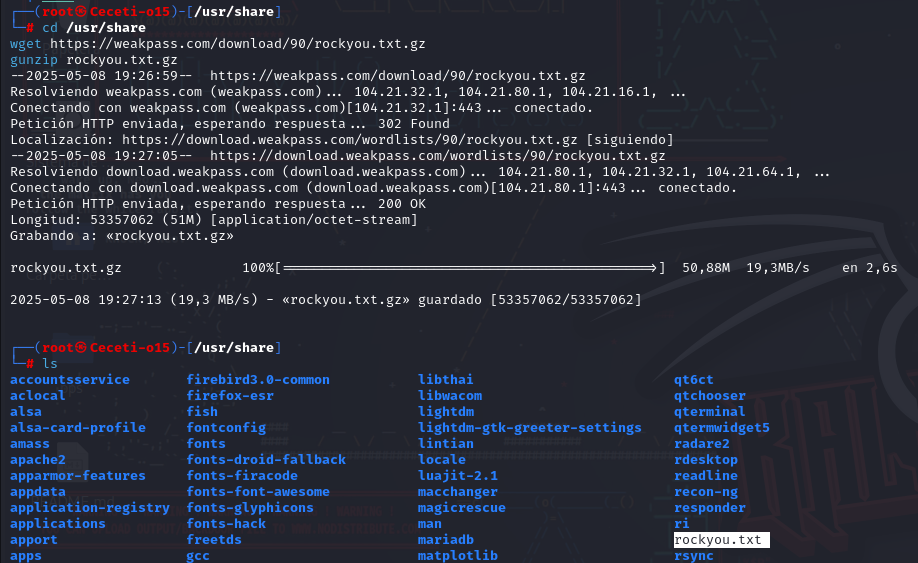

Creamos el archivo [login_weak.php](Recursos/login_weak.php) sustituyendo **mi_password** por la contraseña de root de nuestra BBDD:

Acceder a la pagina web aunque también podemos poner directamente el usuario y contraseña. Un ejemplo es el siguiente enlace:

```http://localhost:85/brokenAuthentication/login_weak.php?username=admin&password=1234```


Vemos que aparece inicio de sesión exitoso.

**Vulnerabilidades del código:**

1. Inyección SQL: La consulta SQL usa variables sin validación, lo que permite ataques de inyección.
2. Uso de contraseñas en texto plano: No se usa hashing para almacenar las contraseñas, lo que facilita su robo en caso de acceso a la base de datos.
3. Falta de control de intentos de inicio de sesión: No hay mecanismos de protección contra ataques de fuerza bruta.
4. Falta de gestión segura de sesiones: No se generan tokens de sesión seguros tras un inicio de sesión exitoso.

## Ataque de fuerza bruta con Hydra

Si el sistema no tiene un límite de intentos fallidos, se puede usar Hydra para adivinar contraseñas:

Hydra es un malware de tipo troyano bancario que se enfoca en infectar dispositivos Android para robar credenciales bancarias. Además, proporciona una puerta trasera a los atacantes que permite incluir el dispositivo como parte de una botnet y realizar otras actividades maliciosas.

En esta ocasión vamos a simular ser los atacantes y vamos a hacer un ataque de fuerza bruta con Hydra. Intentaremos acceder con todos los usuarios y las contraseñas incluidas en el diccionario rockyou.txt que hemos descargado anteriormente.

Recordamos que seremos nosotros los atacantes, por eso desde nuestro equipo anfitrión, donde hemos descargado hydra y el diccionario, ejecutamos:

```hydra -l admin -P /usr/share/rockyou.txt -s 85 localhost http-post-form "/brokenAuthentication/login_weak.php:username=^USER^&password=^PASS^:Usuario o contraseña incorrectos" -V```


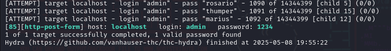

## Explotación de SQL Injection

Cómo ya vimos en la actividad de Inyección de SQL, el atacante puede intentar un payload malicioso en el campo de contraseña:

```
username: admin
password: ' OR '1'='1
```
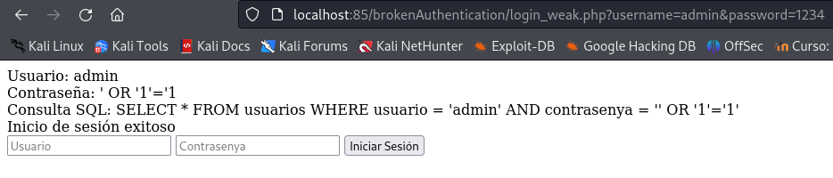


## Mitigación de Broken authentication

### Uso de contraseñas cifradas con password_hash

La primera aproximación es no guardar las contraseñas en texto, sino aplicarle encriptación o hash que lo hemos visto ya en los contenidos teóricos.

Para almacenar las contraseñas hasheadas, deberemos de modificar la tabla donde guardamos los usuarios, por lo que tenemos que realizar varias operaciones:

1. Accedemos al contenedor de la BBDD y nos conectamos a la base de datos:

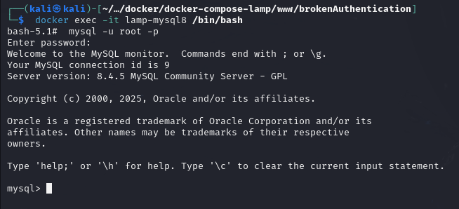

2. Y seleccionamos la BBDD y modificamos la tabla:

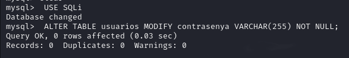

3. Creamos la función [ạdd_user.php](Recursos/add_user.php) para introducir los usuarios con su contraseña hasheada (Debemos cambiar MiContraseña por la de root) y añadimos a un usuario con su contraseña hasheada:

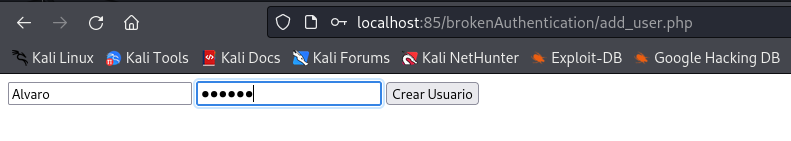

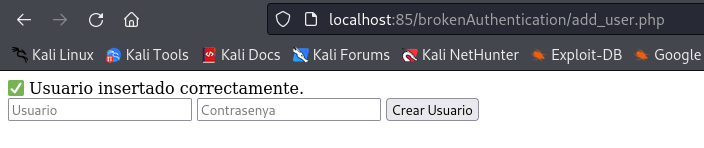

Ya creo el usuario, y si lo comprobamos en la db tiene la contraseña hasheada:

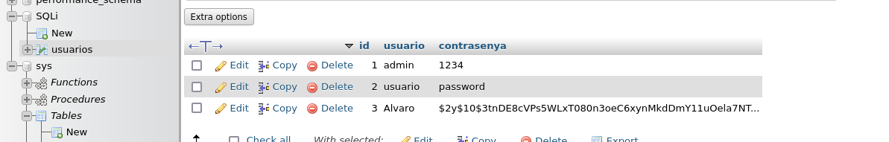

La función **password_hash()** con **PASSWORD_BCRYPT** genera un hash de hasta 60 caracteres, y con **PASSWORD_ARGON2ID**, incluso más (hasta 255). Por eso, se necesita que la columna pueda almacenarlos adecuadamente.

Aplicando mitigaciones de uso de contraseñas con **password_hash** tendríamos el siguiente archivo: [login_weak1.php](Recursos/login_weak1.php):

Como vemos en la siguiente imagen nos da un login exitoso:

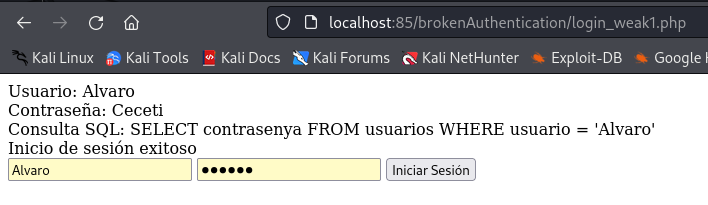

### Uso de consultas preparadas

La siguiente aproximación es usar consultas preparadas, así evitamos ataques de SQL injection.

Creamos el archivo [login_weak2.php](Recursos/login_weak2.php) con el siguiente contenido:

Como vemos, hemos usado consutas paremetrizadas y además hemos utilizado las funciones para manejar las contraseñas hasheadas:

> 🔐 ¿Cómo funciona?

> password_hash($password, PASSWORD_DEFAULT) genera una contraseña hasheada segura.

> password_verify($input, $hash_guardado) verifica si la contraseña ingresada coincide con la almacenada.

### Implementar bloqueo de cuenta tras varios intentos fallidos

Para bloquear la cuenta después de 3 intentos fallidos, podemos hacer lo siguiente:

1. Añadir un campo failed_attempts en la base de datos para contar los intentos fallidos.

2. Registrar el timestamp del último intento fallido con un campo last_attempt para poder restablecer los intentos después de un tiempo.

3. Modificar la lógica del login:

	- Si el usuario tiene 3 intentos fallidos, bloquear la cuenta.

	- Si han pasado, por ejemplo, 15 minutos desde el último intento, restablecer los intentos fallidos.

	- Si el login es exitoso, reiniciar los intentos fallidos a 0.

Modificación en la Base de Datos:

Accede a la BBDD como hemos hecho al principio de la actividad y modificala de la siguiente forma:

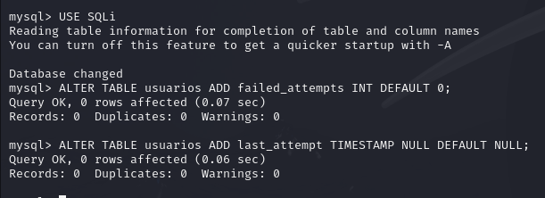

Vemos como se han añadido las columnas indicadas:

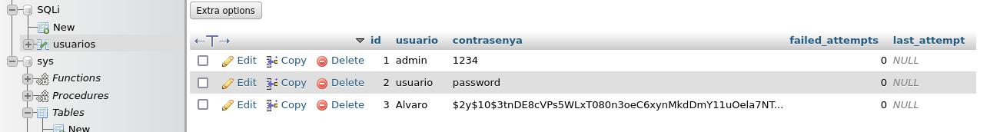

**Código seguro**

Creamos el fichero [login_weak3.php](Recursos/login_weak3.php):

🔍 Qué hace este código:

- Si el usuario tiene 3 fallos y han pasado menos de 15 minutos, la cuenta se bloquea temporalmente.
- Si han pasado más de 15 minutos, los intentos se reinician automáticamente.
- Si el login es exitoso, se ponen los intentos a cero y se borra el last_attempt.

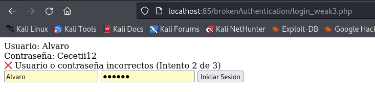

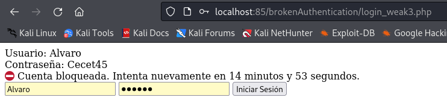

### Implementar autenticación multifactor (MFA)

Para añadir MFA (Autenticación Multifactor) al sistema de login, seguiremos estos pasos:

> 1. Generar un código de verificación temporal (OTP) de 6 dígitos.
> 2. Enviar el código OTP al usuario mediante correo electrónico o SMS (en este caso, usaremos correo simulado con una archivo PHP.
> 3. Crear un formulario para que el usuario ingrese el código OTP después de iniciar sesión.
> 4. Verificar el código OTP antes de permitir el acceso.

🧩 ¿Qué vamos a crear?

- Modificaciones en la base de datos:
	- Campos mfa_code (VARCHAR) y mfa_expires (DATETIME).

- Flujo dividido en dos archivos:

	- login_weak4.php: usuario y contraseña → si correctos, se genera el MFA.

	- verificar_mfa.php: el usuario introduce el código que se le muestra.

	- mostrar_codigo.php: archivo que muestra el código generado.

**1. Modificación en la Base de Datos**

Accede a la BBDD como hemos hecho al principio de la actividad y modificala de la siguiente forma:

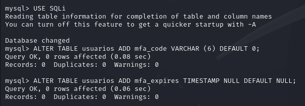

**🔐 2. login_weak4.php (login + generación del código)**

Crea el archivo [login_weak4.php](Recursos/login_weak4.php) (recuerda cambiar la contraseña):

**🪪 3. mostrar_codigo.php**

Creamos el archivo [mostrar_codigo.php](Recursos/mostrar_codigo.php) con el que visualizaremos el código enviado. Esto simula el ver el código en el email.

Creamos el archivo [verificar_mfa.php](Recursos/verificar_mfa.php) que nos indicará si el código introducido es correcto (recuerda cambiar la contraseña).

🧪 Flujo de prueba

- En login.php, introduces usuario y contraseña.

- Si están bien, se genera un código y vas a mostrar_codigo.php.

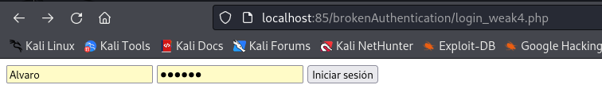

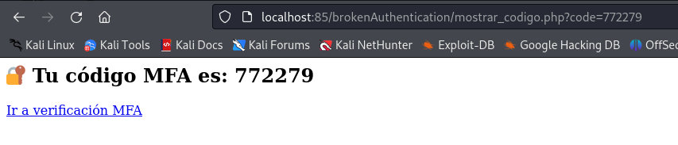

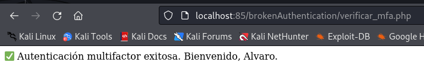


🔒 Flujo completo del Login con MFA

1. Usuario ingresa su usuario y contraseña.

2.  Si las credenciales son correctas, se genera un código OTP y se guarda en la BD.

3. Se envía el código OTP al usuario por correo electrónico (fichero emails_simulados.txt).

4. Usuario ingresa el código OTP en un formulario.

5. El sistema verifica si el código es válido y no ha expirado.

6. Si es correcto, el usuario accede; si no, se muestra un error.

🚀 Beneficios de este Sistema MFA

✔ Mayor seguridad contra accesos no autorizados.

✔ Protege contra ataques de fuerza bruta, incluso si la contraseña es robada.

✔ Fácil de extender a SMS o aplicaciones como Google Authenticator.
